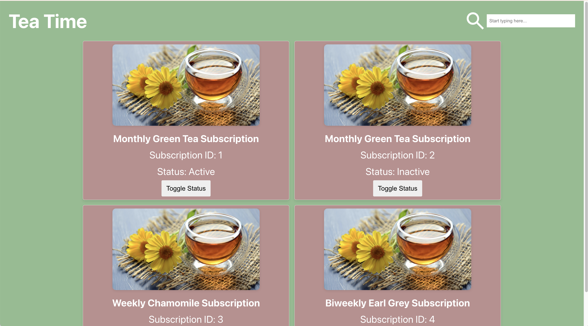
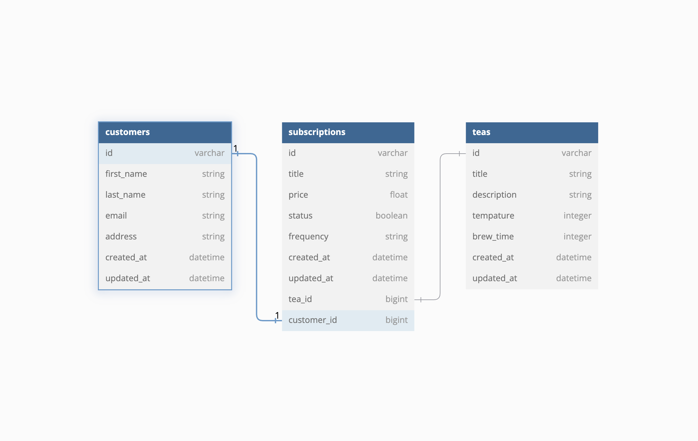
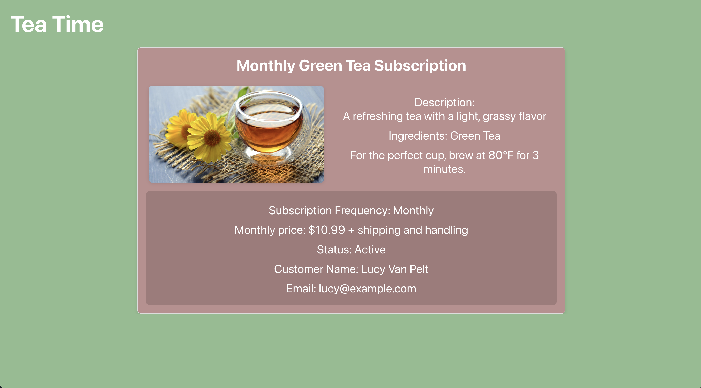
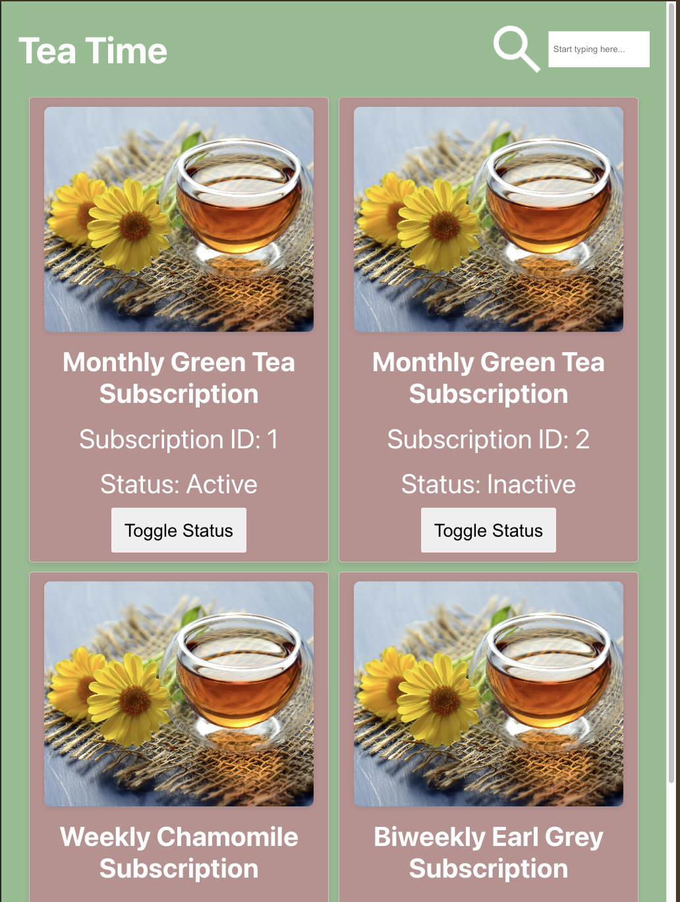
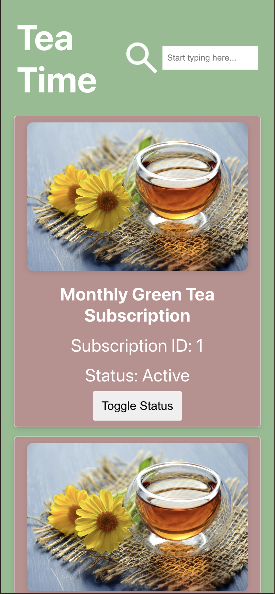

# Tea Time

### Abstract:
[//]: <> (Briefly describe what you built and its features. What problem is the app solving? How does this application solve that problem?)

This project is a React-based web application that provides a dynamic interface for managing and exploring tea subscriptions. The app fetches data from a Rails API backend, displaying a list of available tea subscriptions, with details about each subscription including title, status, pricing, and customer information.

The user can interact with the subscriptions list by clicking on individual subscriptions to view detailed information, toggle the active status of a subscription, and see real-time updates without requiring a page refresh. The app handles potential API errors gracefully, providing clear feedback to the user when issues arise.

### Installation Instructions:
[//]: <> (What steps does a person have to take to get your app cloned down and running?)

1. Fork and clone this BE repo: 
[Tea Time Backend Repo](https://github.com/reneemes/tea_subscription_be)
2. `cd` into the repo
2. Run these commands in your terminal
  - `bundle install`
  -  `rails db:{drop, create, migrate, seed}`
  -  `rails s`

4. Fork this FE repo
[Tea Time Frontend Repo](https://github.com/reneemes/tea-subscription-fe)
5. `cd` into cloned repo
6. Run `npm install`
7. Run `npm start`
8.  Enter `control + c` in your terminal to stop running the React app at any time
<!-- 9. To run Cypress tests, use `npx cypress open` -->

<!-- <h2 align="center"> Usage </h2> -->

### Preview of App:
[//]: <> (Provide ONE gif or screenshot of your application - choose the "coolest" piece of functionality to show off. gifs preferred!)
#### Browser

#### Tablet

#### Smartphone

### Context:
[//]: <> (Give some context for the project here. How long did you have to work on it? How far into the Turing program are you?)
This project was a mock technical take-home challenge designed to simulate a real-world coding assessment. The task required me to dedicate two full days, with a structured time block of 8 hours each day, to develop both the front-end and back-end components of a web application from scratch. I was responsible for designing a responsive and user-friendly interface, implementing state management with React, and creating an efficient RESTful API with Rails to handle data interactions.

Given the limited timeframe, I had to strategically prioritize building a Minimum Viable Product (MVP) to meet core functionality requirements first, while planning additional features as enhancements. This required careful decision-making to ensure that essential features were implemented without sacrificing code quality or user experience. The challenge tested my skills in full-stack development, problem-solving, and effective time management, showcasing my ability to deliver a complete and functional product under tight deadlines.

### Tech Stack:
BE - Ruby on Rails, tested with RSpec, SimpleCov

FE - Built with React and tested with Cypress

### Contributors:
[//]: <> (Who worked on this application? Link to your GitHub. Consider also providing LinkedIn link)
Renee Messersmith - [linkedin](https://www.linkedin.com/in/reneemessersmith/) - [gitHub](https://github.com/reneemes) - rmessersmith25@gmail.com
